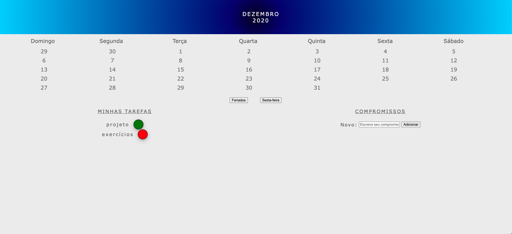

# Exercício de Eventos e Manipulação do DOM

Este projeto é um exercício prático de manipulação do DOM (Document Object Model) e uso de eventos em JavaScript puro. O objetivo foi explorar como interagir com elementos HTML, responder a ações do usuário e modificar dinamicamente o conteúdo da página.

# 🚀 O que foi feito neste exercício?
Neste exercício, aprendi e pratiquei os seguintes conceitos:

# 1. Criação Dinâmica de Dias do Mês
Implementei uma função que cria dinamicamente os dias do mês de dezembro em uma lista.

Adicionei classes específicas para destacar feriados e sextas-feiras.

# 2. Botão de Feriados
Criei um botão que, ao ser clicado, altera a cor de fundo dos dias que são feriados.

Utilizei dataset para armazenar a cor original e alternar entre cores ao clicar.

# 3. Botão de Sexta-Feira
Implementei um botão que, ao ser clicado, altera o texto dos dias que são sextas-feiras para "Sextou!".

Usei dataset para armazenar o texto original e alternar entre os textos.

# 4. Efeitos de Hover nos Dias
Adicionei um efeito visual que aumenta o tamanho da fonte dos dias quando o usuário passa o mouse sobre eles.

Quando o mouse sai do elemento, o tamanho da fonte volta ao normal.

# 5. Seleção de Tarefas
Implementei uma funcionalidade que permite ao usuário selecionar uma tarefa clicando nela.

Apenas uma tarefa pode estar selecionada por vez, e a seleção é destacada com uma classe específica.

# 6. Adicionar Tarefas aos Dias
Criei uma funcionalidade que permite ao usuário adicionar uma tarefa a um dia específico do calendário.

A cor do texto do dia é alterada para a cor de fundo da tarefa selecionada.

# 7. Adicionar Tarefas à Lista
Implementei um campo de entrada que permite ao usuário adicionar novas tarefas a uma lista.

A tarefa pode ser adicionada pressionando o botão "Adicionar" ou a tecla "Enter".

# 💻 Estrutura do Projeto
O projeto consiste em três arquivos principais:

index.html: Contém a estrutura básica do HTML, incluindo o calendário, os botões e o campo de entrada.

style.css: Contém os estilos aplicados aos elementos, como cores, fontes e espaçamentos.

main.js: Contém toda a lógica de manipulação do DOM e tratamento de eventos.

# 📌 Dicas e Observações
Aprendi a importância de usar event.target para identificar o elemento que disparou um evento.

Explorei a manipulação de classes CSS com classList.add e classList.remove para destacar elementos dinamicamente.

Utilizei métodos como appendChild para adicionar novos elementos ao DOM e addEventListener para responder às ações do usuário.

Pratiquei a limpeza de campos de entrada após interações do usuário para melhorar a experiência.

# 🌟 Recursos Úteis
- [Documentação do MDN sobre DOM](https://developer.mozilla.org/pt-BR/docs/Web/API/Document_Object_Model)

- [Guia de Markdown](https://www.markdownguide.org/)

- [JavaScript.info - Manipulação do DOM](https://www.markdownguide.org/)

- [W3schools](https://www.w3schools.com/js/js_htmldom_eventlistener.asp)

🖼️ Imagem do Exercício

Feito por **Everton Balland** ☘️
